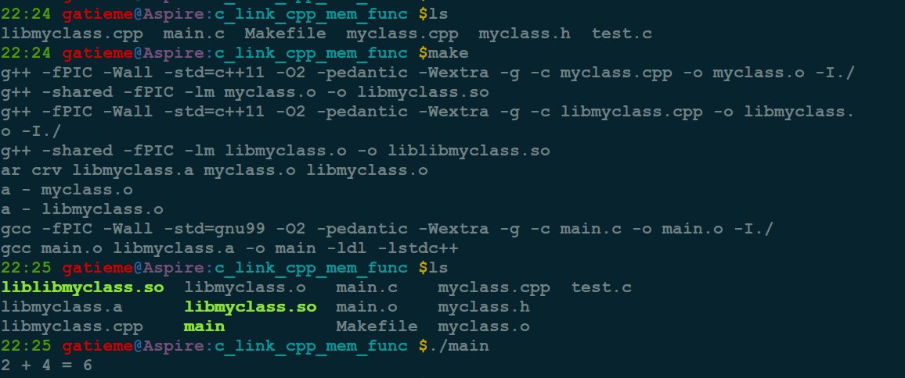

C语言调用C++的函数库
=======

http://blog.csdn.net/coolmeme/article/details/7184331

http://www.educity.cn/develop/478645.html

http://blog.163.com/hbu_lijian/blog/static/1261291532012102571310685/


http://blog.csdn.net/caspiansea/article/details/9676153


#1	C++中调用C的接口
-------

我们在阅读一些库的代码的时候, 经常看到有些函数被extern "C"来修饰


##1.1	extern "C"引入C的库代码
-------


如下所示

```cpp
extern "C" void func();
```


如果需要修饰的函数比较多, 则使用如下方式


```cpp
#ifdef __cplusplus
extern "C"
{
#endif

/////////////////////
//  一段代码
/////////////////////

#ifdef __cplusplus
}
#endif
```

>如果你不想理解这段代码的意义, 那么请你记住 : 在你的代码不知道是被`c`调用还是`c++`调用时, 请添加此段代码.

下面详细说明此段代码的意义：
`__cplusplus`是`c++`编译器(如`g++`等)定义的宏, 如果是`c++`调用的话， `extern "C"`声明会有效. 如果时c调用的话, 那么, extern "C"`声明无效

要明白为何使用extern "C", 还得从cpp中对函数的重载处理开始说起.

在c++中，为了支持重载机制，在编译生成的汇编码中，要对函数的名字进行一些处理, 加入比如函数的返回类型等等. 而在C中, 只是简单的函数名字而已, 不会加入其他的信息.

也就是说 : `C++`和`C`在编译后对产生的函数名字的处理是不一样的. 而上面的代码`extern "C"`目的就是主要实现C与C++的相互调用问题.


对于C++编译器, 由于`__cplusplus`宏被定义, 因此通过`extern "C"`来通知C++编译器编译后的代码是按照C的obj文件格式编译的，要连接的话按照C的命名规则去找.


>`C`和`C++`对函数的处理方式是不同的. `extern "C"`是使`C++`能够调用`C`写作的库文件的一个手段, 如果要对编译器提示使用`C`的方式来处理函数的话, 那么就要使用`extern "C"`来说明.


这种方法有两种妙用

1.	在C源代码中使用extern "C"这样代码及时添加到C++的项目工程中, 也可以正常的被编译和链接

2.	多数情况下我们C的库都是SDK(包括头文件和lib包), 没有源代码, 那么在我们的C++代码中使用extern "C"就通知编译器我们引入了C库的代码


##1.2	示例程序
-------


下面我们通过一个示例来看看C++中如果调用C的函数, 代码在[`language/c/cpp/cpp_link_c`](https://github.com/gatieme/AderXCoding/tree/master/language/c/cpp/cpp_link_c)

我们在`add.c`中定义了一个add函数, 这个函数是C语言实现的函数接口

```cpp
// add.c
#include <stdio.h>
#include <stdlib.h>


int add(const int a, const int b)
{
    return (a + b);
}
```


我们C++中在main函数调用C语言实现的add函数

```cpp
//  main.cpp
#include <iostream>
using namespace std;


#ifdef __cplusplus
extern "C"
{
#endif

int add(const int a, const int b);

#ifdef __cplusplus
}
#endif


int main( )
{
    std::cout <<add(3, 4) <<std::endl;

    return 0;
}
```


下面是我们的`Makefile`信息, 我们生成了两个可执行程序main_normal和main_sdk

*	main_normal为main.o和add.o直接编译生成, C++中通过extern "C"直接以源码的方式生成了main_normal

*	main_sdk类似于我们开发的方式, 首先用add.c生成了一个sdk库libadd.so, 然后main.c中通过extern "C"以C的方式链接了libadd.so中的add函数, 生成了main_sdk

```cpp
#  the compile options
CFLAGS = -Wall -std=gnu99 -O2 -pedantic -Wextra -g
CXXFLAGS = -Wall -std=c++11 -O2 -pedantic -Wextra -g

SHAREDLIB_LINK_OPTIONS = -shared


FPIC = -fPIC

#  the include directory
INC = -I./


target=main_sdk main_normal libadd.so


all:$(target)


main_sdk : main.o libadd.so
	$(CXX) $^ -o $@ -L./ -ladd


main_normal : main.o add.o
	$(CXX) $^ -O $@

libadd.so : add.o
	$(CC) $(SHAREDLIB_LINK_OPTIONS) $(FPIC) $(LDFLAGS) $^ -o $@

#libmyclass.a:myclass.o func.o
#	ar crv $@ $^


%.o : %.cpp
	$(CXX) $(FPIC) $(CXXFLAGS) -c $^ -o $@ $(INC)


%.o : %.c
	$(CC) $(FPIC) $(CFLAGS) -c $^ -o $@ $(INC)


clean :
	rm -rf *.o
	rm -rf $(target)

```


由于`C++`是高度兼容`C`的, 只需要通知C++编译器按照C的命名方式编译和链接二进制代码即可, 除了编译命名的处理不需要额外的层次, 因此这种方式很好的解决了, `C++`代码中编译链接`C`源代码的问题

但是`C`语言却不支持`C++`面向对象的特性, 这个问题该怎么解决啊.


**C调用C++的函数借口信息**


前面我们讲解了, `C++`是一个`C`基础上扩展的支持面向对象的高级语言, 因此我们将`C`调用`C++`的函数的方法分为面向过程和面向对象两种特性分开讨论.


*	`C`中调用`C++`中基本的数据和成员(面向过程的数据)

*	`C`中调用`C++`中类成员数据(面向对象的数据)


#2	`C`中调用`C++`中基本的数据和成员(面向过程的数据)
-------


C++面向过程的部分是完全兼容C的, 因此其本质上俊只是编译阶段的处理不同而已, 但是C++也引入了一些新的特性, 比如函数重载等, 这些需要我们单独去兼容.


##2.1	基本函数的处理
-------

这部分C与C++是完全兼容的, 没有区别, 因此使用extern "C"的方式就足以处理.

将C++函数声明为"extern "C"(在你的C++代码里做这个声明), 然后调用它(在你的C或者C++代码里调用).

例如：

我们有`add.cpp`做出的一套C++的库接口, 其中包含`add`函数借口, 但是这套接口是C++的, 我们想要在C程序中使用这个C++的库借口, 该如何实现呢


我们同样以一段示例来展示, 参见[`language/c/cpp/c_link_cpp_func`](https://github.com/gatieme/AderXCoding/tree/master/language/c/cpp/c_link_cpp_func)

首先是我们的C++库的源代码

```cpp
// add.cpp
int add(const int a, const int b)
{
    return (a + b);
}
```

我们想要在C程序中使用这个函数接口, 但是`C++`并不兼容`C`的接口, 考虑我们可以通过增加一个中间层来实现, 进行一次封装, 将C++的库封装成C编译器可识别的形式

中间层`libadd.cpp`的形式如下, 其实就是用`C++`编译器编译出一套C编译器可识别的代码, 同样是通过`extern "C"`来实现, 将`add`函数封装成`call_cpp_add`函数

```cpp
//  libadd.cpp
int add(const int a, const int b);

#ifdef __cplusplus
extern "C"
{
#endif

int call_cpp_add(const int a, const int b)
{
    return add(a, b);
}

#ifdef __cplusplus
}
#endif
```


那这样以来`call_cpp_add`函数虽然用`C++`编译器编译, 但是编译成`C`编译器可识别的格式, 我们就可以在`C`源程序`main`中调用`C`编译器可以识别的`call_cpp_add`函数.

```cpp
//  main.c
#include <stdio.h>
#include <stdlib.h>


int call_cpp_add(const int a, const int b);

int main( )
{
    printf("%d\n", call_cpp_add(2, 4));

    return 0;
}
```


下面是`Makefile`的信息

```cpp
#  the compile options
CFLAGS = -Wall -std=gnu99 -O2 -pedantic -Wextra -g
CXXFLAGS = -Wall -std=c++11 -O2 -pedantic -Wextra -g

SHAREDLIB_LINK_OPTIONS = -shared


FPIC = -fPIC

#  the include directory
INC = -I./

target=main_sdk libadd.so


all:$(target)


main_sdk : main.o libadd.so
	$(CC) $^ -o $@ -L./ -ladd -lstdc++


libadd.so : libadd.o add.o
	$(CXX) $(SHAREDLIB_LINK_OPTIONS) $(FPIC) $(LDFLAGS) $^ -o $@


%.o : %.cpp
	$(CXX) $(FPIC) $(CXXFLAGS) -c $^ -o $@ $(INC)

%.o : %.c
	$(CC) $(FPIC) $(CFLAGS) -c $^ -o $@ $(INC)

clean :
	rm -rf *.o
	rm -rf $(target)
```


##2.2	`C`语言调用`C++`重载函数的处理
-------


C++支持函数重载的, 函数名相同但是参数不同的重载函数在编译后链接的名字并不相同而可以被识别, 这种情况下, 我们引入一个中间层的方法同样可以实现C中调用C++的函数借口, 其实现与上一节C中调用C++非重载基本函数成员的实现没有什么区别, 只是为各个重载函数均实现一套接口而已


我们仍然以一个示例来展示, 代码参见[`language/c/cpp/c_link_cpp_overload_func`](https://github.com/gatieme/AderXCoding/tree/master/language/c/cpp/c_link_cpp_overload_func)

首先是我们的`C++`接口, 如下所示

```cpp
//  add.cpp
//#include <iostream>
int add(const int a, const int b)
{
    return (a + b);
}

double add(const double a, const double b)
{
    //std::cout <<a <<", " <<b <<std::endl;
    return (a + b);
}
```

我们为此实现一个中间层`libadd.cpp`, 通过`C++`编译器用`extern "C"`将其编译成C编译器可识别的接口


```cpp
// libadd.cpp
int add(const int a, const int b);
double add(const double a, const double b);

#ifdef __cplusplus
extern "C"
{
#endif

int call_cpp_add_int(const int a, const int b)
{
    return add(a, b);
}

double call_cpp_add_double(const double a, const double b)
{
    return add(a, b);
}

#ifdef __cplusplus
}
#endif
```


最后是我们的C源程序, 调用我们的中间层

```cpp
//  main.c
#include <stdio.h>
#include <stdlib.h>


int call_cpp_add_int(const int a, const int b);
double call_cpp_add_double(const double a, const double b);

int main( )
{
    printf("2 + 4 = %d\n", call_cpp_add_int(2, 4));
    printf("2.1 + 4.5 = %lf\n", call_cpp_add_double(2.1, 4.5));

    return 0;
}
```


最后是`Makefile`, 我们通过中间层`libadd.cpp`将`C++`的接口转换成C编译器可以识别的格式, 然后添加在我们的C源程序`main.c`中


```cpp
#  the compile options
CFLAGS = -Wall -std=gnu99 -O2 -pedantic -Wextra -g
CXXFLAGS = -Wall -std=c++11 -O2 -pedantic -Wextra -g

SHAREDLIB_LINK_OPTIONS = -shared

FPIC = -fPIC

#  the include directory
INC = -I./

target=main_sdk libadd.so

all:$(target)


main_sdk : main.o libadd.so
	$(CC) $^ -o $@ -L./ -ladd -lstdc++

libadd.so : libadd.o add.o
	$(CXX) $(SHAREDLIB_LINK_OPTIONS) $(FPIC) $(LDFLAGS) $^ -o $@

%.o : %.cpp
	$(CXX) $(FPIC) $(CXXFLAGS) -c $^ -o $@ $(INC)

%.o : %.c
	$(CC) $(FPIC) $(CFLAGS) -c $^ -o $@ $(INC)

clean :
	rm -rf *.o
	rm -rf $(target)
```


##2.2	C中调用C++中类成员数据(面向对象的数据)
-------


首先是myclass类的信息


```cpp
/////////////////////
// myclass.h
/////////////////////
#ifndef __MY_CLASS_H_INCLUDE__
#define __MY_CLASS_H_INCLUDE__


#include <iostream>

using namespace std;


class MyClass
{
public :
    //  member function
    int add(int a, int b);
};


#endif  //  #define __MY_CLASS_H_INCLUDE__


/////////////////////
//  myclass.cpp
/////////////////////
#include "myclass.h"


//  member function
int MyClass::add(int a, int b)
{
    return (a + b);
}
```


接着我们实现的借口类

```cpp
/////////////////////
//  libmyclass.cpp
/////////////////////
#include <iostream>
using namespace std;

#include "myclass.h"


#ifdef __cplusplus
extern "C"
{
#endif


/* extern "C" */int call_cpp_class_add(int a, int b)
{
    MyClass mc;

    return mc.add(a, b);
}


#ifdef __cplusplus
}
#endif
```


然后是main函数

```cpp
/////////////////////
//  main.cpp
/////////////////////
#include <stdio.h>
#include <stdlib.h>

extern int call_cpp_class_add(int a, int b);

int main(void)
{
    printf("2 + 4 = %d\n", call_cpp_class_add(2, 4));

    return 0;
}
```


最后附上我们的`Makefile`, 静态库链接后生成了main, 而动态链接库链接后生成了main_sdk

```cpp
#####################
#  Makefile
#####################

#  the compile options
CFLAGS = -Wall -std=gnu99 -O2 -pedantic -Wextra -g
CXXFLAGS = -Wall -std=c++11 -O2 -pedantic -Wextra -g

SHAREDLIB_LINK_OPTIONS = -shared

FPIC = -fPIC
#  the include directory
INC = -I./


target=libmyclass.so libmyclass.a main main_sdk


all:$(target)


main : main.o libmyclass.a
	$(CC) $^ -o $@ -ldl -lstdc++


main_sdk : main.o libmyclass.so
	$(CC) $^ -o $@ -ldl -lstdc++ -L./ -lmyclass


libmyclass.a : myclass.o libmyclass.o
	ar crv $@ $^


libmyclass.so : libmyclass.o myclass.o
	$(CXX) $(SHAREDLIB_LINK_OPTIONS) $(FPIC) $(LDFLAGS) $^ -o $@


%.o:%.cpp
	$(CXX) $(FPIC) $(CXXFLAGS) -c $^ -o $@ $(INC)


%.o:%.c
	$(CC) $(FPIC) $(CFLAGS) -c $^ -o $@ $(INC)


clean :
	rm -rf *.o
	rm -rf $(target)
```





