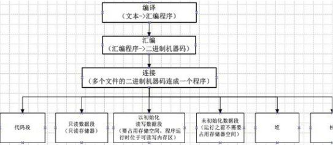
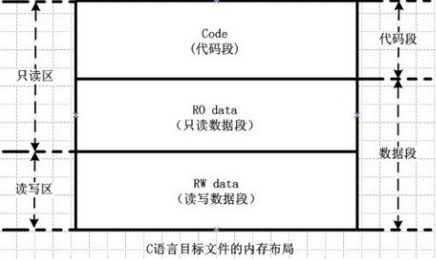
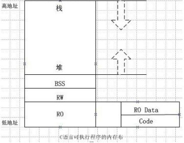
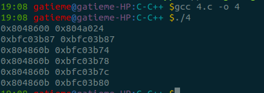

[C程序的内存布局(Memory Layout)](http://blog.csdn.net/gatieme/article/details/43567433)
=======


由C语言代码（文本文件）形成可执行程序（二进制文件），需要经过编译-汇编-链接三个阶段。编译过程把C语言文本文件生成汇编程序，汇编过程把汇编程序形成二进制机器代码，链接过程则将各个源文件生成的二进制机器代码文件组合成一个文件。

C语言编写的程序经过编译-连接后，将形成一个统一格式的二进制可执行文件，这个格式是一个依照可执行文件格式的，可以被系统识别，并且加载到内存中执行的，它由几个部分组成。在程序运行时又会产生其他几个部分，各个部分代表了不同的存储区域：



#1	静态区域（全局区域）
-------

全局变量和静态变量的存储是放在一块的，初始化的全局变量和静态变量在一块区域(RW data), 未初始化的全局变量和未初始化的静态变量在相邻的另一块区域（BSS）。 程序结束后有系统释放

##1.1	文本段（Text）
-------

通常代码段和只读数据段合成为文本段(Text), 包含实际要执行的代码（机器指令）和常量。它通常是共享的，多个实例之间共享文本段。文本段是不可修改的。


##1.2	代码段（Code）
-------

代码段由程序中执行的机器代码组成。在C语言中，程序语句进行编译后，形成机器代码。在执行程序的过程中，CPU的程序计数器指向代码段的每一条机器代码，并由处理器依次运行。

##1.3	只读数据段（RO data，即常量区）
-------

只读数据段是程序使用的一些不会被更改的数据，使用这些数据的方式类似查表式的操作，由于这些变量不需要更改，因此只需要放置在只读存储器中即可。

通常字符串常量就是放置在这里，程序结束后由系统释放。

>**注意**
>
>这个区域的存在与否，一直是一个争议的地方，但是我们这里认同是存在的，因为我们的程序中的确出现了与其他数据段不同的一块区域，但是往往很多时候大家把只读数据段（RO data）和下面的已初始化读写数据段（RW data）合成为数据段data，但是其实这个是不合适的，因为在执行过程中，这两个区域的读写权限是不同的，顾名思义，只读数据段（RO data）是只读的，而已初始化读写数据段是可读可写的。


##1.4	已初始化读写数据段（RW data  -- Initialized Data Segment）
-------

已初始化数据是在程序中声明，并且具有初值的变量，这些变量需要占用存储器的空间，在程序执行时它们需要位于可读写的内存区域内，并具有初值，以供程序运行时读写。


##1.5	未初始化数据段（BSS --Uninitialized Data Segment）
-------

未初始化数据是在程序中声明，但是没有初始化的变量，这些变量在程序运行之前不需要占用存储器的空间。
        Block Started by Symbol，BSS段的变量只有名称和大小却没有值

#2	动态区域
-------

##2.1	堆（heap）
-------

堆内存只在程序运行时出现，一般由程序员分配和释放。在具有操作系统的情况下，如果程序没有释放，操作系统可能在程序（例如一个进程）结束后回收内存。注意它与数据结构中的堆是两回事，分配方式倒是类似于链表。

##2.2	栈（stack）
-------

栈内存只在程序运行时出现，在函数内部使用的变量、函数的参数以及返回值将使用栈空间，栈空间由编译器自动分配和释放。其操作方式类似于数据结构中的栈。


代码段（Code）、只读数据段（RO data）、读写数据段（RW Data）、未初始化数据段（BSS）属于静态区域。

堆和栈属于动态区域。

代码段（Text）、只读数据段（RO data）和初始化读写数据段（RW data）在程序链接后即产生，存在与可执行文件中
但是未初始化数据段（BSS）将在程序初始化的时候开辟，而堆和栈作为动态区域在程序运行的过程中分配和释放。





一个可执行程序分为映像和运行两种状态。在编译链接后形成的映像中，将只包含代码段（text）、只读数据段（RO data）和读写数据段（RW data）。在程序运行之前加载的过程中，将动态生成未初始化数据段（BSS），在程序运行时将动态生成堆（Heap）和栈（Stack）区域。

在系统中，可执行文件（或者程序）最终只有放置在内存中才能运行的，程序的几个段，最终也会转化为内存中的几个区域。





在内存中，从地地址向高地址，依次是只读段、读写段、未初始化代码段、堆区域和栈区域。只读区域即文本段（Text）包含了代码段（Code）和只读数据段（RO data），在内存区域中。

映像文件中，将包含代码段（code）、只读数据段（RO data）以及读写数据段（RW data），未初始化代码段（BSS）在程序初始化即加载时开辟，而堆栈段在程序运行时动态开辟。

对于程序运行过程中的内存使用，堆和栈一般是相向扩展的。堆的分配由程序来分配，但是栈是由编译器管理的。


#3	示例代码
-------


```c
#include <stdio.h>
#include <stdlib.h>
#include <malloc.h>

//http://tech.ccidnet.com/art/302/20070108/995995_1.html
#define SHW_VAR_ADR(ID, I)                    \
printf("the %20s\t is at adr:%p\n", ID, &I); //打印变量地址宏


#define SHW_POT_ADR(ID, I)                    \
printf("the %20s\t is at adr:%p\n", ID, I);  //打印指针指向地址宏


extern void afunc(void);

/*extern etext, edata, end;*/

/**
(1)全局变量和静态变量的存储是放在一块的，
初始化的全局变量和静态变量在一块区域（RW data），
未初始化的全局变量和未初始化的静态变量在相邻的另一块区域（BSS）。
程序结束后有系统释放
如下面(1).1   (1).2   (1).3所述
**/
// (1).1  -- 只要是静态变量，即使是局部的，也不存储在栈中，而是即存储在静态区域中，并依据其是否初始化，分别存储在BSS段和DATA段
static int /*bss_*/unini_glo_sta_var;                           //  静态未初始化全局变量，虽然系统会默认初始化为0，但仍然存放在BSS区
static int /*data_*/ini_glo_sta_var = 10;                       //  静态初始化全局变量，存放在RW DATA区

// (1).2  --  只要是全局变量，即存储在静态区域，并依据其是否初始化，分别存储在BSS段和DATA段
int /*bss_*/unini_glo_var;                                      //  未初始化全局数据存储在BSS数据区
int /*data_*/ini_glo_var = 42;                                  //  初始化全局数据存储在RW DATA数据区

// (1).3  --  全局常量，其本身是全局变量，即存储在静态区域, 同(1).2
const int unini_glo_cnt_var;                                        //  未初始化全局常量[不安全]， 自动初始化为0， 但仍然存放在BSS区
const int ini_glo_cnt_var = 10;                                     //  初始化全局常量，存储在常量区
// 对于常量我们需要注意的问题在于，他们并不像我们期望的那样存储在常量区(RO data)，
// 常量区只用于存储初始化好的全局常量以及字符串变量本身（不是是指针）
// 局部常量作为局部量仍然存储与栈中
// 因为常量区与代码段是在一起的（在有些段分类结果中，是不存在常量区的，常量区和代码段合成为代码区）
// 而本身来说常量只是限制了其读写权限，这种读写权限的限制可以在编译阶段由编译器进行制定和限制，
// 这样在严格的编译器审查结果下，运行阶段的代码就不存在对常量的读写操作，因此就没必要将其他局部常量也存储在常量区
// 否则将造成代码段的臃肿。。。

static int unini_glo_sta_cnt_var;
static int ini_glo_sta_cnt_var = 10;

int main(void)
{
    char *p_alloca = NULL, *b_malloc = NULL, *nb_malloc = NULL;

    // (1).4  局部静态变量，仍然是静态变量，同(1).1
    static int unini_sta_var;               //  局部未初始化静态变量，存储在BSS段
    static int ini_sta_var = 10;            //  静态初始化局部变量，存储在DATA段中

    // 局部非静态变量存储在栈中
    // (2).1  --  局部变量(不管初始化没有)存储在栈中
    int unini_var;                          //  局部未初始化变量，
    int ini_var = 10;                       //  局部初始化变量

    //  (2).2  --  局部常量(不管初始化没有)存储在栈中, 同(2).1
    const int unini_cnt_var;            // 未被初始化的局部常量，不安全，存储在栈中
    const int ini_cnt_var = 10;         // 局部常量，存储在栈中

    //  (2).3  --  指针常量和常量指针，其本质还是局部变量或者局部常量，存储在栈中，同(2).1 (2).2
    const int *p_cnt_var =  &ini_cnt_var;   //  指向常量的指针
    int * const cnt_p_var = &ini_var;       //  指针常量
    const int * const cnt_p_cnt_var =  &unini_cnt_var;    // 指向常量的常指针

    // (3)  字符串常量，存储在常量区
    /*const */char* str_cnt = "ABCDE";      //  字符串面变量, 存储在常量区, 即（RO data）
                                            //  本代码等价于const char* str1 = "ABCDE"
    char str_array[] = "ABCDE";             //  字符数组， 相当于初始化的局部变量，存储在栈中


/*    printf("Adr etext:%8x\t Adr edata %8x\t Adr end %8x\t\n", &etext, &edata, &end);*/

    // TEXT段 -- 代码段
    printf("------------------------------------------------------\n");
    printf(".Text Location:\n");
    SHW_VAR_ADR("main", main);              //查看代码段main函数位置
    SHW_VAR_ADR("afunc", afunc);           //查看代码段afunc函数位置
    printf("------------------------------------------------------\n\n");

    // BSS段 -- 未初始化全局变量区
    printf("------------------------------------------------------\n");
    printf(".Bss Location:\n");
    SHW_VAR_ADR("unini_glo_sta_var", unini_glo_sta_var);                //  全局未初始化静态变量, 在BSS段
    SHW_VAR_ADR("unini_sta_var", unini_sta_var);                        //  未初始化静态变量，在BSS段
    SHW_VAR_ADR("unini_glo_cnt_var", unini_glo_cnt_var);                //  全局未初始化常量，在BSS段
    SHW_VAR_ADR("unini_glo_var", unini_glo_var);                        //  全局未初始化变量在, BSS段
    SHW_VAR_ADR("unini_glo_sta_cnt_var", unini_glo_sta_cnt_var);        //  全局未初始化静态常量，在BSS段
    printf("------------------------------------------------------\n\n");


    // RW DATA段 -- 可读写已初始化数据段
    printf("------------------------------------------------------\n");
    printf(".Data Location:\n");
    SHW_VAR_ADR("ini_glo_sta_var", ini_glo_sta_var);                    //  全局初始化静态变量存储在RW data区域
    SHW_VAR_ADR("ini_glo_var", ini_glo_var);                            //  全局初始化变量存储在RW data

    SHW_VAR_ADR("ini_sta_var", ini_sta_var);                            //  局部初始化静态变量存储在RW data区域

    SHW_VAR_ADR("ini_glo_sta_cnt_var", ini_glo_sta_cnt_var);            //  全局静态已初始化常量，存储在RW data区域
    printf("------------------------------------------------------\n\n");

    // RO data  --  只读数据段
    printf("------------------------------------------------------\n\n");
    printf("RW data");
    SHW_VAR_ADR("ini_glo_cnt_var", ini_glo_cnt_var);     // 初始化全局常量，同字符串面变量一样，位于文本区，即常量区
    SHW_POT_ADR("str_cnt", str_cnt);                  //  字符串面变量保存在常量区，即文本区
    SHW_VAR_ADR("str_cnt", str_cnt);             //  指针str1本身在栈中

    printf("------------------------------------------------------\n\n");

    // STACK -- 栈
    printf("------------------------------------------------------\n");
    printf("Stack Locations:\n");
    afunc();                                    //   递归调用5此afunc函数

    p_alloca = (char *)alloca(32);              //   从栈中分配空间, 用完立即释放
    if(p_alloca != NULL)
    {
        SHW_VAR_ADR("start", p_alloca);
        SHW_VAR_ADR("end",p_alloca + 31);
    }


    // 局部变量(不管初始化没有)存储在栈中
    SHW_VAR_ADR("unini_var", unini_var);
    SHW_VAR_ADR("ini_var", ini_var);

    //  局部常量(不管初始化没有)存储在栈中
    SHW_VAR_ADR("unini_cnt_var", unini_cnt_var);        // 未被初始化的局部常量，不安全，存储在栈中
    SHW_VAR_ADR("ini_cnt_var", ini_cnt_var);            // 局部常量，存储在栈中

    //  指针常量和常量指针，其本质还是局部变量或者常量，存储在栈中
    SHW_VAR_ADR("p_cnt_var", p_cnt_var);            //  该指向常量的指针，其本身其实是一个（初始化的）局部变量[同ini_var], 存储在栈中
    SHW_VAR_ADR("cnt_p_var", cnt_p_var);            //  该指针常量，其本身其实是一个初始化的局部常量[同ini_cnt_var]， 存储在栈中
    SHW_VAR_ADR("cnt_p_cnt_var", cnt_p_cnt_var);    //  该指向常量的指针常量作为一个初始化的局部常量，存储在栈中

    SHW_POT_ADR("str_array", str_array);             //  字符串数组，相当于初始化的局部变量，保存在栈中
    SHW_VAR_ADR("str_array", str_array);             //  指针str2本身在栈中，其地址本身，就是字符串数组的地址

    printf("------------------------------------------------------\n\n");


    printf("------------------------------------------------------\n");
    printf("Heap Locations:\n");
    b_malloc = (char *)malloc(32 * sizeof(char));   //从堆中分配空间
    nb_malloc = (char *)malloc(16 * sizeof(char));  //从堆中分配空间
    printf("the Heap start: %p\n", b_malloc);   //堆起始位置
    printf("the Heap end:%p\n",(nb_malloc + 16 * sizeof(char)));//堆结束位置

    // 指针指向的区域在堆中，但是指针本身在栈中
    printf("\nb and nb in Stack\n");
    SHW_VAR_ADR("b_malloc", b_malloc);       //显示栈中数据b的位置
    SHW_VAR_ADR("b_malloc", nb_malloc);     //显示栈中数据nb的位置
    free(b_malloc);               //释放申请的空间，以避免内存泄漏
    b_malloc = NULL;
    free(nb_malloc);              //释放申请的空间，以避免内存泄漏
    nb_malloc = NULL;
    printf("------------------------------------------------------\n\n");


    return EXIT_SUCCESS;
}

void afunc(void)
{
    static int long level=0;          // 静态数据存储在数据段中
    int      stack_var;               // 局部变量，存储在栈区
    if(++level==5)                    // 此函数递归调用5次
    {
        return;
    }
    printf("stack_var is at:%p\n",&stack_var);
    //      SHW_VAR_ADR("stack_var in stack section",stack_var);
    //      SHW_VAR_ADR("Level in data section",level);
    afunc();
}
```

上面我们发现了一个意向不到的问题，就是在于常量的存储，常量并没有按照我们的要求全部存储在常量区，相反，仅仅是仅仅是全局未初始化变量和字符串变量存储在了常量区，其他的常量依据其他规则存储（比如局部常量存储在栈中），这是
 因为常量与普通变量只是读写权限的限制，这个限制我们可以在编译时由编译器指定，规矩我们的代码，这样通过编译器的静态检查，在运行时就可以保证常量的读写权限。


我们可以使用如下代码验证

```c
#include <stdio.h>
#include <stdlib.h>


static const int a = 10;
static int car = 10;

int main()
{
    printf("%p %p\n", &a, &car);
    char str1[] = "abcd";
    char *str2 = "abcd";
    printf("%p %p\n", str1, &str1);  // 栈区域
    printf("%p %p\n", str2, &str2);  // str2，即字符串"abcd"在常量区, 而指针本身的地址&str3在栈中

    const char *str3 = "abcd";       //  常量指针, 指向常量的指针

    printf("%p %p\n", str3, &str3);  //  str3，即字符串"abcd"在常量区, 而指针本身的地址&str3在栈中

    char * const str4 = "abcd";      //  指针常量, 指针本身是常量
    printf("%p %p\n", str4, &str4);  //  str4，即字符串"abcd"在常量区, 而指针本身的地址&str4在栈中

    const char * const str5 = "abcd";
    printf("%p %p\n", str5, &str5); //  str5, 即字符串"abcd"在常量区，而指针本身的地址&str5在栈中
}
```

运行结果如下图所示




我们会发现只有字符串本身是存储在常量区的，而我们的变量（数组名也是一个局部常量）或者指针都是存储在栈中，而且我们会很容易发现他把字符串本身存放在常量区是有其他用处的，这样所有的指针指向的字符串“abcd”在内存中只需要一个备份即可。
代码中str3, str4, str5都指向了同一个地址“abcd”这也是编译器的一个优化。

#4	数据存储类别
-------


讨论C/C++中的内存布局，不得不提的是数据的存储类别！数据在内存中的位置取决于它的存储类别。一个对象是内存的一个位置，解析这个对象依赖于两个属性：存储类别、数据类型。

1.	存储类别决定对象在内存中的生命周期。

2.	数据类型决定对象值的意义，在内存中占多大空间。

C/C++中由（auto、 extern、 register、 static）存储类别和对象声明的上下文决定它的存储类别。

##4.1	自动对象（automatic objects）
-------

auto和register将声明的对象指定为自动存储类别。他们的作用域是局部的，诸如一个函数内，一个代码块{***}内等。操作了作用域，对象会被销毁。

在一个代码块中声明一个对象，如果没有执行auto，那么默认是自动存储类别。

声明为register的对象是自动存储类别，存储在计算机的快速寄存器中。不可以对register对象做取值操作“&”。

##4.2	静态对象（static objects）
-------


静态对象可以局部的，也可以是全局的。静态对象一直保持它的值，例如进入一个函数，函数中的静态对象仍保持上次调用时的值。包含静态对象的函数不是线程安全的、不可重入的，正是因为它具有“记忆”功能。

局部对象声明为静态之后，将改变它在内存中保存的位置，由动态数据--->静态数据，即从堆或栈变为数据段或bbs段。

全局对象声明为静态之后，而不会改变它在内存中保存的位置，仍然是在数据段或bbs段。但是static将改变它的作用域，即该对象仅在本源文件有效。此相反的关键字是extern，使用extern修饰或者什么都不带的全局对象的作用域是整个程序。

#5	总结
-------

本文介绍了C/C++中由源程序到可执行文件的步骤，和可执行程序的内存布局，数据存储类别，最后还通过一个例子来说明。
可执行程序中的变量在内存中的布局可以总结为如下：

*	变量（函数外--全局变量）：

	1.	如果未初始化，则存放在BSS段；

	2.	否则存放在data段

*	变量（函数内--局部变量）：

	1.	如果没有指定static修饰符即局部变量，均存放在栈中；

	2.	如果指定static，则成为静态变量，存储位置同上

*	常量：

	1.	局部常量本质仍然是局部变量，存储在栈中，

	2.	全局常量或者字符串面变量，存放在文本段.text中只读数据段(RO data)


在常量中我们需要注意的一个问题在于，很多情况下，我们期待常量都会存放在常量区，但是结果出乎我们的意料，仅仅是全局未初始化常量和祖父穿常量存储在常量区, 局部的常量仍然存储在栈中, 因为常量与普通变量只是读写权限的限制，这个限制我们可以在编译时由编译器指定，规矩我们的代码，这样通过编译器的静态检查，在运行时就可以保证常量的读写权限。

*	函数参数：
存放在栈或寄存器中


内存可以分为以下几段：

*	文本段(代码段+只读数据段)：
包含实际要执行的代码（机器指令）和常量。它通常是共享的，多个实例之间共享文本段。文本段是不可修改的，只读

*	初始化数据段：
包含程序已经初始化的全局变量，.data。

*	堆：
动态内存，由用户管理。通过malloc/alloc/realloc、new/new[]申请空间，通过free、delete/delete[]释放所申请的空间。由低地址想高地址扩展。   

*	未初始化数据段：
包含程序未初始化的全局变量，.bbs。该段中的变量在执行之前初始化为0或NULL。

*	栈：
由系统管理，由高地址向低地址扩展。

在以上概念中，只是一种内存分布，并没有考虑实际的情况。在实际的系统中，程序有载入（加载）和运行两种概念。在不同的系统中实际运行时其实会有细微的区别，这些我们会在下一篇，C程序运行的详细过程中继续讲


| 全局/局部 | 静态/动态 | 是否初始化 | 存储位置 |
|:--------:|:-------:|:-------:|:-------:|
| 全局 | 静态   | 初始化  | BSS-未初始化数据段BSS --Uninitialized Data Segment |
| 全局 | 静态   | 未初始化 | DATA--已初始化读写数据段RW data  -- Initialized Data Segment |
| 全局 | 非静态 | 初始化   | DATA |
| 全局 | 非静态 | 未初始化 | BSS |
| 局部 | 静态   | 初始化   | BSS|
| 局部 | 静态   | 未初始化 | DATA |
| 局部 | 非静态  | 初始化  | STACK--栈区 |
| 局部 | 非静态  |未初始化 | STACK--栈区 |


<font color=0x00ffff>
*	全局变量与静态变量存储方式相同, 如果初始化则存储在DATA(RW)可读写数据段, 如果未初始化则存储在BSS未初始化数据段

*	局部变量非静态变量则存储在栈stack中

*	对于常量, 局部常量本质仍然是局部变量, 在栈中, 全局常量或者字符串面变量, 在数据段中只读数据段(RO data)

*	程序的代码存储代码段.text中

</font>


|  段区域  | 地址空间 | 存储变量 |
|:--------:||:--------:|:--------:|
| stack    | 栈stack                     | 局部变量和常量                  |
| heap     | 堆heap                      | 动态分配的数据                  |
| BSS      | 未初始化数据段BSS           | 未初始化的全局变量以及静态变量  |
| RWDATA   | 已初始化读写数据段RW data   | 已初始化的全局变量和静态变量    |
| RO data  | 只读文本段中的数据段RO data | 全局常量或者字符串面变量        |
| code     | 只读文本段的程序代码段 code | 程序的代码                      |


其中可以

将RW DATA与RO data合称为数据段data, 将code成为代码段

也可以将RO DATA与code段合成为只读文本段
