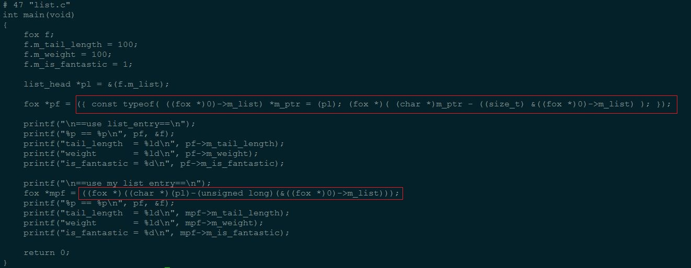
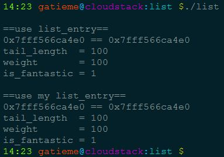

> 参见 :http://blog.csdn.net/gatieme/article/details/51085350

>链表是一种复杂的数据结构，其数据之间的相互关系使链表分成三种：单链表、循环链表、双向链表，而内核中的链表又是如何实现的呢？
>
>linux内核主要是有C和汇编写成的，C是面向过程的语言，但是linux内核却用C实现了一套面向对象的设计模式，linux内核中处处体现着面向对象的思想

#传统的链表实现
-------

之前我们前面提到的链表都是在我们原数据结构的基础上增加指针域next(或者prev)，从而使各个节点能否链接在一起，

比如如下的结构信息

```c
typedef struct fox
{    
    unsigned long       tail_length;          /*  尾巴长度, 以厘米为单位 */
    unsigned long       weight;               /*  重量, 以千克为单位     */
    bool                is_fantastic;         /*  这只狐狸奇妙么         */
}fox;
```

存储这个结构到链表里面的方法是在数据结构中嵌入链表指针

```c
typedef struct fox
{    
    unsigned long      tail_length;          /*  尾巴长度, 以厘米为单位 */
    unsigned long     weight;               /*  重量, 以千克为单位     */
    bool               is_fantastic;         /*  这只狐狸奇妙么         */
    struct fox         *prev;      /*  指针域, 指向上一个狐狸   */
    struct fox         *next;      /*  指针域, 指向下一个狐狸   */
}fox;
```

#linux内核链表的实现
-------
>在之前的版本中，内核中有许多链表实现的方法，但是杂乱无章，而且各行其道，于是内核黑客们就选择了一个既简单有高效的方式来统一他们
>
>在linux-2.1内核开发系列中首次引入了官方的内核链表实现，从此内核中的所有链表现在都是用了官方的链表实现了

相比普通的链表实现方式，我们的内核实现可以说是独树一帜，，它不是将数据结构塞进链表吗，而是将链表节点塞进数据结构

链表的实现内核源代码在linux/list.h中声明， 不同的内核版本中文件位置可能所有差异，凡是其数据结构不变

>参见 http://lxr.free-electrons.com/ident?i=list_head

##struct list_head链表结点
-------

其数据结构简洁明了

```c
/*
 * 文件list.h--http://lxr.free-electrons.com/source/scripts/kconfig/list.h#L18
 */
struct list_head
{
    struct list_head    *prev;
    struct list_head    *next;
};

```

##把链表结点list_head塞进数据结构
-------

好了也许你看到这个感觉很奇怪，是很简洁，但是这样一个结构怎么用呢？到底怎么表示链表的真正存储结构呢？

一切的关键就在于，这个list_head结构如何使用，**把链表结点list_head塞进数据结构**

```c
typedef struct fox
{
    unsigned long       tail_length;          /*  尾巴长度, 以厘米为单位  */
    unsigned long       weight;               /*  重量, 以千克为单位      */
    bool                is_fantastic;              /*  这只狐狸奇妙么          */
    struct list_head    list;                      /*  所有fox结构体形成的链表*/
}fox;
```

好了我们貌似知道怎么回事了？

在数据结构中塞入了我们的list_head，那么当组成链表的时候，所有的fox节点的list域串联在一起组成链表，我们一次遍历其实就是遍历所有的list_head域，由于**每个数据结构的节点fox是连续存储的，那么我们知道了一个结构体对象fox中某个成员（比如list_head成员list）的地址，通过偏移就可以计算出整个结构体对象起始位置的地址**

##通过成员指针找到结构体对象的首地址
-------

linux内核为我们提供了一组宏，通过这组宏，我们可以简单的通过结构体某个成员的地址，获取到整个结构体对象的首地址，从而获取到指向整个结构体成员的指针

linux内核提供了list_entry的宏，来通过成员对象指针来获取到整个对象的指针，

首先我们先不考虑内核如何实现，如果是我们我们要怎么实现呢?

```c
#define list_entry(ptr, type, member) / 
((type *)((char *)(ptr)-(unsigned long)(&((type *)0)->member))) 
```

这个倒是不难理解：从一个结构的成员指针找到其容器的指针。
但是正因为如此，我的第一感觉是，这个宏的名字应该更加抽象，名字似乎应该改称叫“寻找容器”一类的，查看list.h源代码，发现现在的定义是这样的：

```
#define list_entry(ptr, type, member) /
    container_of(ptr, type, member)

#define container_of(ptr, type, member)                 /
({                                                        /
    const typeof( ((type *)0)->member ) *__mptr = (ptr);/
    (type *)( (char *)__mptr - offsetof(type,member) ); /
})

#define offsetof(TYPE, MEMBER) ((size_t) &((TYPE *)0)->MEMBER)
```

linux不想用C++，但又想利用C++的优点，如是出现了很多奇怪的宏，他们叫做trick。

*    ptr是找容器的那个成员变量的指针，把它减去自己在容器中的偏移量的值就应该得到容器的指针。（容器就是包含自己的那个结构）。

*    指针的加减要注意类型，用(char*)ptr是为了计算字节偏移。((type *)0)->member是一个小技巧。

*    前面的（type *）再转回容器的类型。

那么我们将宏完全展开，就得到如下的代码

```
#define list_entry(ptr, type, member) /
        ((type *)((char *)(ptr)-(unsigned long)(&((type *)0)->member)))
```
ptr是指向list_head类型链表的指针，type为一个结构，而member为结构type中的一个域，类型为list_head，这个宏返回指向type结构的指针。在内核代码中大量引用了这个宏，因此，搞清楚这个宏的含义和用法非常重要。

```c
 ((type *)((char *)(ptr)-(unsigned long)(&((type *)0)->member)))：
```

*    (char *)(ptr)使得指针的加减操作步长为一字节，

*    (unsigned long)(&((type *)0)->member)等于ptr指向的member到该member所在结构体基地址的偏移字节数。

*    二者一减便得出该结构体的地址。

*    转换为 (type *)型的指针，

#示例
-------
```c
#include <stdio.h>
#include <stdlib.h>
#include <stdbool.h>

/*
 * 该示例参见linux-kernel中内核链表list的实现
 *
 * 文件list.h
 * http://lxr.free-electrons.com/source/scripts/kconfig/list.h#L18
 */
typedef struct list_head
{
    struct list_head    *m_prev;
    struct list_head    *m_next;
}list_head;


typedef struct fox
{
    unsigned long       m_tail_length;          /*  尾巴长度, 以厘米为单位  */
    unsigned long       m_weight;               /*  重量, 以千克为单位      */
    bool                m_is_fantastic;         /*  这只狐狸奇妙么          */
    struct list_head    m_list;
}fox;

#define offsetof(TYPE, MEMBER) ((size_t) &((TYPE *)0)->MEMBER)


#define container_of(ptr, type, member)                             \
({                                                                  \
    const typeof( ((type *)0)->member) *m_ptr = (ptr);              \
    (type *)( (char *)m_ptr - offsetof(type, member) );             \
})


#define list_entry(ptr, type, member)                               \
    container_of(ptr, type, member)

#define my_list_entry(ptr, type, member)                            \
    ((type *)((char *)(ptr)-(unsigned long)(&((type *)0)->member)))


int main(void)
{
    fox f;
    f.m_tail_length = 100;
    f.m_weight = 100;
    f.m_is_fantastic = true;

    list_head *pl = &(f.m_list);

    fox *pf = list_entry(pl, fox, m_list);

    printf("\n==use list_entry==\n");
    printf("%p == %p\n", pf, &f);
    printf("tail_length  = %ld\n", pf->m_tail_length);
    printf("weight       = %ld\n", pf->m_weight);
    printf("is_fantastic = %d\n", pf->m_is_fantastic);

    printf("\n==use my list_entry==\n");
    fox *mpf = my_list_entry(pl, fox, m_list);
    printf("%p == %p\n", pf, &f);
    printf("tail_length  = %ld\n", mpf->m_tail_length);
    printf("weight       = %ld\n", mpf->m_weight);
    printf("is_fantastic = %d\n", mpf->m_is_fantastic);

    return 0;
}

```


可以使用gcc -E查看宏展开的信息




运行结果



