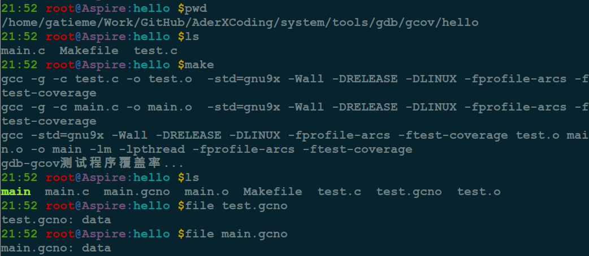
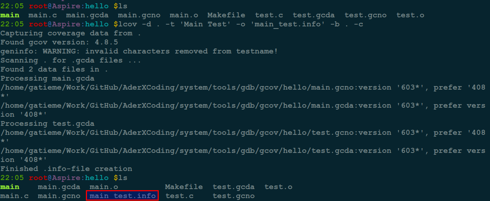

GCOV+LCOV 代码调试和覆盖率统计工具
=======

| CSDN | GitHub |
|:----:|:------:|
| [GCOV+LCOV 代码调试和覆盖率统计工具](http://blog.csdn.net/gatieme/article/details/78368667) | [`AderXCoding/system/tools/gdb/gcov`](https://github.com/gatieme/AderXCoding/tree/master/system/tools/gdb/gcov) |

<br>

<a rel="license" href="http://creativecommons.org/licenses/by-nc-sa/4.0/"></a>

本作品采用<a rel="license" href="http://creativecommons.org/licenses/by-nc-sa/4.0/">知识共享署名-非商业性使用-相同方式共享 4.0 国际许可协议</a>进行许可, 转载请注明出处, 谢谢合作

因本人技术水平和知识面有限, 内容如有纰漏或者需要修正的地方, 欢迎大家指正, 也欢迎大家提供一些其他好的调试工具以供收录, 鄙人在此谢谢啦

<br>


#1	GCOV介绍
-------


#2	GCOV使用方法
-------

`gcov` 是 `Linux` 下 `GCC` 自带的一个 `C/C++` 代码覆盖率分析工具.

`gcov` 常用参数 :

| 参数 | 描述 |
|:---:|:---:|
| -a | 输出每个基本块的运行计数, 此选项可用于统计在同一行中的若干语句的各自运行次数 |
| -b | 输出分支语句频率信息到输出文件, 以及概要信息到标准输出, 但不显示无条件分支 |
| -c | 以数字而不是百分比显示分支频率 |
| -n | 不创建输出文件 |
| -l | 创建的输出文件名中包含头文件名, 这对于头文件中包含代码并被多个源文件使用时有用 |
| -p | 在 `.gocv` 文件名中加入完整的路径信息, 此时路径中的 '/' 用 '#' 表示, '..' 用 '^' 表示 |
| -f | 输出每个函数的概要信息 |

`.gcov` 文件的基本格式是 :

执行次数(`-` 表示该行没代码, `#####` 表示该行从未执行过):行号:该行代码

交叉 `profiling` :

`gcov` 要求运行时在目标系统中有相同的编译时的绝对目录路径, 为了支持交叉编译, 可使用下面两个
环境变量重定位数据文件 :

| 环境变量 | 描述 |
|:------:|:----:|
| `GCOV PREFIX` | 指定加入到目标文件中的绝对路径前缀, 默认没有前缀 |
| `GCOV PREFIX STRIP` | 指示要跳过的目录层次 |

比如编译后目标文件在 `/user/build/foo.o`, 编译后的程序执行时会创建 `/user/build/foo.gcda` 文件. 但若把程序拷贝到目标系统中运行时, 可能并没有这个目录, 此时设置环境变量.

‘GCOV_PREFIX=/target/run’

‘GCOV_PREFIX_STRIP=1’

这样, 运行时将输出到 `/target/run/build/foo.gcda` 文件. 然后可把生成的所有. `gcda` 文件拷贝到本机编译时的代码目录中使用 `gcov` 工具.


*	编译程序

使用方法 : 在 `gcc` 或者 `g++` 后面添加参数 `-fprofile-arcs -ftest-coverage`

>注意 :
>
>`-fprofile-arcs -ftest-coverage`
>
>必须同时在编译器和链接器上设置, `Makefile` 里面可以加在 `CFLAGS` 和 `LDFLAGS` 上, 如果连接的时候出现 `undefined reference to '__gcov_init'` 错误, 则还要加上 `-lgocv`

*	运行程序生成 `gcda` 数据文件

编译成功后运行编译好的程序, 然后退出程序. 程序会在当前目录下生成 `*.gcda` 文件.

*	使用 `gcov` 生成 `.gcov` 代码覆盖数据

然后使用 `gcov *.c` 或者 `gcov *.cpp` 生成代码覆盖信息, 这个时候需要将原始代码文件 `*.cpp` 或者 `*.c` 放在 `*.gcda` 文件一个目录中.

完成后会生成 `*.c.gcov` 或者 `*.cpp.gcov` 文件, 里面包含了代码覆盖信息.

*	`lcov` 生成 `info` 图形化数据

由于 `*.gcov` 是文字模式的, `linux` 还自带了一个 `lcov` 工具, 可以帮助我们把文字的信息转换成更直观的图形表格模式.

```cpp
lcov -d . -t '表格名称' -o '文件名称.info' -b . -c
```

*	`gethtml` 生成 `html` 图形文件

此时还没完, 这个指令只是输出了一个 `info` 的中间文件， 要变成 `html` 格式的图形文件.

还要下面的指令 :

```cpp
genhtml -o 输出目录名 文件名.info
```

这样才会在输出目录中生成完整的 `html` 图形文件, 用浏览器在文件目录中打开 `index` 文件就能看到了.


#3	示例
-------


##3.1	示例程序
-------


我们的程序由两个文件 `test.c` 和 `main.c` 组成.


想要用 `gcov` 收集代码覆盖信息， 需要在 `gcc` 编译代码的时候加上这 `2` 个选项 `-fprofile-arcs -ftest-coverage`.


```cpp
// test.c
#include <stdio.h>

void test(int count)
{
	int i;
	for (i = 1; i < count; i++)
	{
		if (i % 3 == 0)
			printf ("%d is divisible by 3\n", i);
		if (i % 11 == 0)
			printf ("%d is divisible by 11\n", i);
		if (i % 13 == 0)
			printf ("%d is divisible by 13\n", i);
	}
}
```


```cpp
// main.c
#include <stdio.h>
#include <stdlib.h>

void test(int vount);

int main(int argc, char *argv[])
{
	int i = 0;
	if(argc == 2)
		i = atoi(argv[1]);
	else
		i = 10;

	printf("arg is %d\n", i);

	test(i);

	return EXIT_SUCCESS;
}
```

```cpp
// Makefile
GCOV_FLAGS=-fprofile-arcs -ftest-coverage
CFLAGS+=$(GCOV_FLAGS)
LDFLAGS+=-lpthread $(GCOV_FLAGS)

target=main


all:$(target)


main : test.o main.o
	$(CC) $(CFLAGS) $^ -o $@ $(LDFLAGS)
	@echo "gdb-gcov测试程序覆盖率..."


%.o : %.c
	$(CC) -g -c $^ -o $@  $(CFLAGS) $(DEFINES)

.PHONY : clean
clean :
	rm -rf *.o
	rm -rf $(target)
	rm -rf  *.gcov *.gcda *.gcno
```

##3.2	编译程序
-------

编译后会得到一个可执行文件 `main`, 然后每个 `C` 文件都对应一个 `*.gcno` 文件

>当用 `gcc` 编译文件的时候, 如果带有 `"-ftest-coverage"` 参数, 就会生成这个 `*.gcno` 文件, 它包含了程序块和行号等信息.





##3.3	运行程序
-------

接下来可以运行这个 `main` 的程序

```cpp
./main
```

运行结束以后会生成一个 `main.gcda` 文件, 如果一个可执行文件带有 `"-fprofile-arcs"` 参数编译出来, 并且运行过至少一次, 就会生成. 这个文件包含了程序基本块跳转的信息.


##3.4 GCOV 生成代码覆盖数据
-------

接下来可以用 `gcov` 生成代码覆盖信息


```cpp
gcov main.c
gcov test.c
```


运行结束以后会生成2个文件hello.c.gcov和myfunc.c.gcov。打开看里面的信息:


被标记为 `#####` 的代码行就是没有被执行过的， 代码覆盖的信息是正确的， 但是让人去读这些文字， 实在是一个杯具. 不用担心, 有另外一个工具叫 `lcov`, 可以用程序解析这些晦涩的字符, 最终输出成 `html`格式的报告.

##3.5	`lcov`生成 `info` 数据
-------

指定 `lcov` 在当前目录 "." 去找代码覆盖的信息, 输出为 `main_test.info`,  这个 `main_test.info` 是一个中间结果, 需要把它用 `1genhtml` 来处理一下, `genhtml` 是 `lcov`里面的一个工具。




##3.6	生成 `html` 数据
-------

```cpp
genhtml -o result main_test.info
```

指定输出目录是 `result`. 一个完整的 `html` 报告就生成了, 做一个连接, 把这个目录连到随便一个 `web server` 的目录下, 就可以看报告了.


生成的信息


#4	参考
-------


[Gcov 详解 + 内核函数覆盖率测试方法详述及产生错误解决办法](http://blog.csdn.net/wangyezi19930928/article/details/42638345)

[代码覆盖率——gcov lcov的使用](http://blog.csdn.net/yukin_xue/article/details/7653482)

[GCOV 使用用例](http://blog.sina.com.cn/s/blog_a2dce6b30101fh6k.html)

[gcov lcov覆盖率统计工具](http://blog.csdn.net/thq0201/article/details/7235571)

[代码覆盖率分析(gcov)](http://www.cnblogs.com/zelos/archive/2007/11/17/3402897.html)

[gcov分析代码覆盖率/gcov输出文件路径问题](http://1219699.blog.163.com/blog/static/5562894201391711116218/)

[GCOV 用法](http://blog.csdn.net/kelsel/article/details/52758206)


[试用内核gcov](http://blog.csdn.net/samssm/article/details/45721423)

[gcov-kernel - a gcov infrastructure for the Linux kernel](http://ltp.sourceforge.net/coverage/gcov.php)

[Gcov单元测试覆盖率 ( by quqi99 )](http://blog.csdn.net/quqi99/article/details/7920399)

[GCC Coverage代码分析-.gcda/.gcno文件及其格式分析](http://blog.csdn.net/livelylittlefish/article/details/6448885)

<br>

*	本作品/博文 ( [AderStep-紫夜阑珊-青伶巷草 Copyright ©2013-2017](http://blog.csdn.net/gatieme) ), 由 [成坚(gatieme)](http://blog.csdn.net/gatieme) 创作.

*	采用<a rel="license" href="http://creativecommons.org/licenses/by-nc-sa/4.0/"></a><a rel="license" href="http://creativecommons.org/licenses/by-nc-sa/4.0/">知识共享署名-非商业性使用-相同方式共享 4.0 国际许可协议</a>进行许可. 欢迎转载、使用、重新发布, 但务必保留文章署名[成坚gatieme](http://blog.csdn.net/gatieme) ( 包含链接: http://blog.csdn.net/gatieme ), 不得用于商业目的.

*	基于本文修改后的作品务必以相同的许可发布. 如有任何疑问，请与我联系.