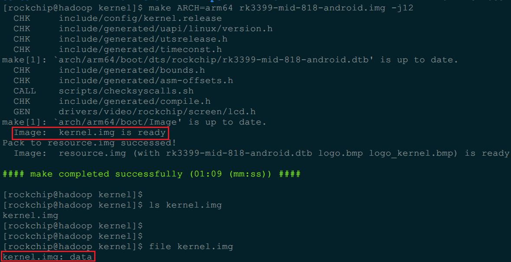

Linux 64位安装32位运行库(解决rk3399 make kernel.img error)
=======

| CSDN | GitHub |
|:----:|:------:|
| [You-Get--基于Python3的开源网络视频下载工具](http://blog.csdn.net/gatieme/article/details/61623891) | [`AderXCoding/system/tools/you-get`](https://github.com/gatieme/AderXCoding/tree/master/system/tools/you-get) |

<br>
<a rel="license" href="http://creativecommons.org/licenses/by-nc-sa/4.0/"></a>
本作品采用<a rel="license" href="http://creativecommons.org/licenses/by-nc-sa/4.0/">知识共享署名-非商业性使用-相同方式共享 4.0 国际许可协议</a>进行许可, 转载请注明出处, 谢谢合作
<br>

[RHEL/CentOS/Fedora各种源(EPEL、Remi、RPMForge、RPMFusion)配置](http://www.cnblogs.com/mawanglin2008/p/3532247.html)


#1	问题描述
-------

*	make kernel.img error
近期实验室购入了 `RK-3399` 的开发板的, 官方的 `SDK` 教程都是基于 `ubuntu` 的, 但本人用远程服务器做开发机, 系统安装的是 `CentOS 7`, 于是试着在 `archlinux` 上编译一下源码, 编译内核时出现以下错误 : ·make: *** [kernel.img] Error 127`

```cpp
#make ARCH=arm64 rk3399-mid-818-android.img -j12
  CHK     include/config/kernel.release
  CHK     include/generated/uapi/linux/version.h
  CHK     include/generated/utsrelease.h
make[1]: `arch/arm64/boot/dts/rockchip/rk3399-mid-818-android.dtb' is up to date.
  CHK     include/generated/timeconst.h
  CHK     include/generated/bounds.h
  CHK     include/generated/asm-offsets.h
  CALL    scripts/checksyscalls.sh
  CHK     include/generated/compile.h
  GEN     drivers/video/rockchip/screen/lcd.h
  OBJCOPY arch/arm64/boot/Image
make: *** [kernel.img] Error 127
```


#2	问题发现
-------


很明显内核构建的过程中 `Image`, 已经构建完毕, 但是在构建 `kernel.img` 时候出现问题, 

我们从 `Makefile` 中看看在生成 `kernel.img` 的时候具体做了什么

```cpp
#cat -n arch/arm64/Makefile | grep kernel.img

   143	kernel.img: Image
   144		$(Q)$(srctree)/scripts/mkkrnlimg $(objtree)/arch/arm64/boot/Image $(objtree)/kernel.img >/dev/null
   145		@echo '  Image:  kernel.img is ready'
   149	%.img: rockchip/%.dtb kernel.img $(LOGO) $(LOGO_KERNEL)
```
可以看到生成 `kernel.img` 的规则在 `Makefile` 的第 `143~145` 行

```cpp
# 查看 makefile 第 142~146 行的信息
#sed -n '142,146p' Makefile

kernel.img: Image
	$(Q)$(srctree)/scripts/mkkrnlimg $(objtree)/arch/arm64/boot/Image $(objtree)/kernel.img >/dev/null
	@echo '  Image:  kernel.img is ready'
```


可以看到生成的规则为

```cpp
scripts/mkkrnlimg arch/arm64/boot/Image kernel.img >/dev/null
```

通过脚本 `mkkrnlimg` 将 `Image` 生成 `kernel.img`, 既然 `kernel.img` 没有生成, 那说明 `mkkrnlimg` 运行出现问题


查看 `mkkrnlimg` 的文件属性

```cpp
#file scripts/mkkrnlimg 
scripts/mkkrnlimg: ELF 32-bit LSB executable, Intel 80386, version 1 (GNU/Linux), statically linked, stripped
```


可以发现, **执行文件 `mkkrnlimg` 是在 32 位平台上运行的, 而我的系统是 64 位的, 问题就在于此了, 为了在 64 位系统上运行 32 位的执行文件, 一般需要安装 `lib32-glibc`, 于是试了一下:


#3	Linux 64 安装32位运行库
-------


参照[What do I need to do to install and run Sourcery CodeBench on an x86 64-bit Linux host system?](https://sourcery.mentor.com/GNUToolchain/kbentry62)

##3.1	CentOS
-------


```cpp
sudo yum install ia32-libs.i686
```

或者


```cpp
sudo yum install xulrunner.i686
```


>PS:可以查看一下当前源库里有没有 `ia32-libs` :  `yum list|grep ia32-`


##3.2	Arch Linux
-------


```cpp
pacman -S lib32-glibc
yaourt -S lib32-glibc
```

这两个指令都找不到 `lib32-glibc`, 于是上官网找了一下, 还是可以找到：
https://www.archlinux.org/packages/multilib/x86_64/lib32-glibc/


于是，下载：`lib32-glibc-2.22-3.1-x86_64.pkg.tar.xz`

安装 : `pacman -U lib32-glibc-2.22-3.1-x86_64.pkg.tar.xz`

再编译即可


##3.3	`Ubuntu` 安装 `32` 位库
-------

*	Ubuntu 13.04 or older


```cpp
apt-get install ia32-libs
```

*	Ubuntu 14.04 and newer

[ubuntu14.04/13.10/13.04 安装32位运行库（成熟技术）](http://blog.csdn.net/anywriting/article/details/38080325)

[ubuntu 14.04 64bit安装32位运行库](http://blog.csdn.net/hj74535099/article/details/50220207)
`14.04` 以后目前 `ia-32`的库已经被移除了, 但是我们仍然可以通过添加 `13.04` 源的方式来安装 `ia-32`


```cpp
sudo apt-get install libc6:i386
sudo -i
# 添加13.04 raring的ia-32源
cd /etc/apt/sources.list.d
echo "deb http://archive.ubuntu.com/ubuntu/ raring main restricted universe multiverse" >ia32-libs-raring.list
apt-get update
apt-get install ia32-libs

# 删除raring的源防止本身的源被污染
rm /ia32-libs-raring.list
apt-get update

exit

sudo apt-get install gcc-multilib
```

注：这种方法肯定能安装上ia32-libs，但由于添加的是13.04的源，所以有没有混淆暂时不清楚，网上也有很多用新立德软件包管理器这样做；够狠，你就这么干。也可以这么安装了ia32-libs后，把/etc/apt/sources.list.d目录下的ia32-libs-raring.list删掉，然后再sudo apt-get update


[Ubuntu16.04(64bit)兼容32bit程序](http://blog.csdn.net/q1302182594/article/details/51610902)

[Ubuntu16.04安装32位支持库](Ubuntu16.04安装32位支持库)

但是其实有更好更安全的方法, `14.04` 之后， 64 位系统可以直接以
```cpp
#这是第一步，让你的系统接受i386架构的安装包，这样才可以在apt-get update时下载相应的list
dpkg --add-architecture i386

#以后通过在包名后面加 :i386 下载相应的包。
apt-get install [package name]:i386
```

比如


```cpp
sudo dpkg --add-architecture i386
sudo apt install libc6:i386
```

[How to run 32-bit app in Ubuntu 64-bit?](https://askubuntu.com/questions/454253/how-to-run-32-bit-app-in-ubuntu-64-bit)


#4	验证
-------


运行

```
scripts/mkkrnlimg arch/arm64/boot/Image kernel.img
```


或者重新编译内核



<br>

<a rel="license" href="http://creativecommons.org/licenses/by-nc-sa/4.0/"></a>本作品采用<a rel="license" href="http://creativecommons.org/licenses/by-nc-sa/4.0/">知识共享署名-非商业性使用-相同方式共享 4.0 国际许可协议</a>进行许可, 转载请注明出处, 谢谢合作.
