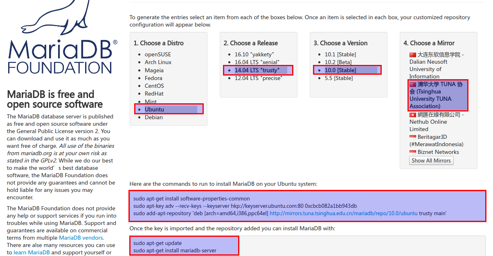

`Ubuntu 14.04(Trusty)` 安装 `MariaDB 10` 数据库
=======

| CSDN | GitHub |
|:----:|:------:|
| [Ubuntu 14.04(Trusty)安装MariaDB 10数据库](http://blog.csdn.net/gatieme/article/details/53048071) | [`AderXCoding/system/tools/mariadb`](https://github.com/gatieme/AderXCoding/tree/master/system/tools/mariadb) |


<br>
<a rel="license" href="http://creativecommons.org/licenses/by-nc-sa/4.0/"></a>
本作品采用<a rel="license" href="http://creativecommons.org/licenses/by-nc-sa/4.0/">知识共享署名-非商业性使用-相同方式共享 4.0 国际许可协议</a>进行许可, 转载请注明出处
<br>


之前一直在使用`Mysql`, 但是后来对比之后还是选择了`MariaDB`, 现在想在自己的服务器和本子上安装上`MariaDB`, 但是Ubuntu14.04源中的版本仍然是5.5, 想在本子上装个新的体验下, 网上看了写教程, 都好老了, 很少有装10的, 少数有的也都是直接沾了PPA源, 但是源从哪里来的也是一头雾水, 因此有了这篇博客,　水平有限, 欢迎交流指正.

#1	MariaDB介绍
-------


##1.1	MariaDB数据库
-------


`MariaDB` 数据库管理系统是 `MySQL` 的一个分支, `MariaDB`努力想成为那些寻求专业的、健壮的、可扩展的、可靠的的 `SQL` 数据库服务的理想选择. 为了达成这个目标, `MariaDB` 基金会与开源社区的用户和开发者以自由和开源软件的精神共同开发着 `MariaDB` 数据库管理系统, 并且以保证可靠性的前提下来开发新的功能的方式来发布这个软件.

`MariaDB`数据库管理系统主要由开源社区在维护, 采用GPL授权许可 `MariaDB`的目的是完全兼容`MySQL`, 包括`API`和命令行，使之能轻松成为`MySQL`的代替品。


在存储引擎方面，使用`XtraDB`（英语：`XtraDB`）来代替`MySQL`的`InnoDB`. `MariaDB`基于事务的`Maria`存储引擎, 替换了`MySQL`的`MyISAM`存储引擎, 它使用了`Percona`的 `XtraDB`, `InnoDB`的变体


##1.2	诞生
-------

`MariaDB`由`MySQL`的创始人`Michael Widenius`(英语：`Michael Widenius`)主导开发，他早前曾以10亿美元的价格，将自己创建的公司`MySQL AB`卖给了`SUN`, 此后, 随着`SUN`被甲骨文收购, `MySQL`的所有权也落入`Oracle`的手中. `MariaDB`名称来自`Michael Widenius`的女儿`Maria`的名字.


`MySQL`之父`Widenius`先生离开了`Sun`之后，觉得依靠`Sun/Oracle`来发展`MySQL`, 实在很不靠谱, 于是决定另开分支, 这个分支的名字叫做`MariaDB`.

`MariaDB`跟`MySQL`在绝大多数方面是兼容的，对于开发者来说，几乎感觉不到任何不同. 目前`MariaDB`是发展最快的MySQL分支版本，新版本发布速度已经超过了`Oracle`官方的`MySQL`版本。

在`Oracle`控制下的`MySQL`开发, 有两个主要问题 :

1. `MySQL`核心开发团队是封闭的, 完全没有`Oracle`之外的成员参加. 很多高手即使有心做贡献, 也没办法做到.

2. `MySQL`新版本的发布速度, 在`Oracle`收购`Sun`之后大为减缓. `Widenius`有一个`ppt`, 用数据比较了收购之前和之后新版本的发布速度. 有很多`bugfix`和新的`feature`, 都没有及时加入到发布版本之中.

以上这两个问题, 导致了各个大公司, 都开发了自己定制的`MySQL`版本, 包括`Facebook`, `Google`, 阿里巴巴等等.

`MySQL`是开源社区的资产, 任何个人/组织都无权据为己有. 为了依靠广大`MySQL`社区的力量来更快速的发展`MySQL`, 另外开分支是必须的。

`MariaDB`默认的存储引擎是`Maria`, 不是`MyISAM`. `Maria`可以支持事务, 但是默认情况下没有打开事务支持, 因为事务支持对性能会有影响. 可以通过以下语句, 转换为支持事务的`Maria`引擎.

```cpp
ALTER TABLE `tablename` ENGINE=MARIA TRANSACTIONAL=1;
```


#2	安装MariaDB
-------


##2.1	源中直接安装 `MariaDB 5.5`
-------

`Ubuntu 14.04` 的源中已经包含了 `MariaDB` 数据库, 参见

http://packages.ubuntu.com/trusty/mariadb-server

因此可以直接安装, 版本是 `5.5.52`

```cpp
sudo apt-get install mariadb-server
```

##2.2	安装 `MariaDB 10`
-------


*	下载源码包或者二进制包安装


如果想要安装新的版本, 需要上官网下载其安装包

下载地址 https://downloads.mariadb.org


*	使用官方提供的源进行安装


我们选择`repository configuration tool`, 或者直接进入

https://downloads.mariadb.org/mariadb/repositories/#mirror=tuna

选择我们对应的系统和环境, 我的环境是`Ubuntu 14.04`, 选择安装 `MariaDB 10.0`, 选择的是清华大学的源



然后系统会提示我们需要添加的源和安装命令, 如下所示


添加源

```cpp
sudo apt-get install software-properties-common
sudo apt-key adv --recv-keys --keyserver hkp://keyserver.ubuntu.com:80 0xcbcb082a1bb943db
sudo add-apt-repository 'deb [arch=amd64,i386,ppc64el] http://mirrors.tuna.tsinghua.edu.cn/mariadb/repo/10.0/ubuntu trusty main'
```

或者你可以手动的方式在 `apt` 源文件中写入 `mariadb` 源的信息, 你可以直接将如下信息写在 `/etc/apt/sources.list`, 或者如果你不想污染源的主配置文件, 可以在 `/etc/apt/sources.list.d`下, 创建名为`MariaDB sources.list`的源文件, 这个文件的名字可以随意, 但是一般为了便于区分, 还是以软件包的名字名为好, 比如我起的名字就是`mariadb-ppa-trusty.list`, 创建完成后将如下信息写入

```cpp
# MariaDB 10.0 repository list - created 2016-11-05 12:47 UTC
# http://downloads.mariadb.org/mariadb/repositories/
deb [arch=amd64,i386] http://mirrors.tuna.tsinghua.edu.cn/mariadb/repo/10.0/ubuntu trusty main
deb-src http://mirrors.tuna.tsinghua.edu.cn/mariadb/repo/10.0/ubuntu trusty main
```


安装mariadb数据库

```cpp
sudo apt-get update
sudo apt-get install mariadb-server
```

参见 https://mariadb.com/kb/en/mariadb/installing-mariadb-deb-files/


#3	配置mariadb
-------

*	若要更改或设置MariaDB密码

方法1： 用SET PASSWORD命令

```cpp
mysql -u root

mysql> SET PASSWORD FOR 'root'@'localhost' = PASSWORD('newpass');
```

方法2：用mysqladmin

```cpp
mysqladmin -u root password "newpass"
```

如果root已经设置过密码，采用如下方法

```cpp
mysqladmin -u root password oldpass "newpass"
```

方法3： 用UPDATE直接编辑user表

```cpp
mysql -u root

mysql> use mysql;

mysql> UPDATE user SET Password = PASSWORD('newpass') WHERE user = 'root';

mysql> FLUSH PRIVILEGES;
```

在丢失root密码的时候，可以这样

```cpp
mysqld_safe --skip-grant-tables&

mysql -u root mysql

mysql> UPDATE user SET password=PASSWORD("new password") WHERE user='root';

mysql> FLUSH PRIVILEGES;
```

*	启动MariaDB

```cpp
service mysql start
```

*	确认 MariaDB 已经启动

```cpp
netstat -tulnp | grep mysql
```


或者

```cpp
service mysql status
```


*	登陆MariaDB

本地机器登陆

```cpp
mysql -uroot -pyourpassword
```
如果是本机,那可以直接使用上面的命令登录，当然，需要输入密码. 如果是远程机器（与MariaDB 所处不同的机器），那么可能需要如下的形式:

其中xxx.xxx.xxx.x 为MariaDB所在机器的IP 或者机器名

```cpp
mysql -h xxx.xxx.xxx.x -P 3306 -uroot -pyourpassword
```

*	简单SQL测试

```cpp
MariaDB [(none)]> use mysql

MariaDB [mysql]> select count(*) from user;
+----------+
| count(*) |
+----------+
|        5 |
+----------+
1 row in set (0.00 sec)
```


想了解更多的关于MariaDB请访问如下的网站 : [MariaDB documentation](https://mariadb.com/kb/en/mariadb/documentation/)


#4	参考资料
-------

[在 CentOS/RHEL/Scientific Linux 6 下安装 LAMP (Apache with MariaDB and PHP)](http://www.linuxidc.com/Linux/2013-07/86755.htm)

[MariaDB Proxy读写分离的实现](http://www.linuxidc.com/Linux/2014-05/101306.htm)

[Linux下编译安装配置MariaDB数据库的方法](http://www.linuxidc.com/Linux/2014-11/109049.htm)

[CentOS系统使用yum安装MariaDB数据库](http://www.linuxidc.com/Linux/2014-11/109048.htm)

[安装MariaDB与MySQL并存](http://www.linuxidc.com/Linux/2014-11/109047.htm)

[Ubuntu 上如何将 MySQL 5.5 数据库迁移到 MariaDB 10]( http://www.linuxidc.com/Linux/2014-11/109471.htm)


[关于远程访问及防火墙设置请参考以下这篇文章](http://www.cnblogs.com/meetweb/p/3701443.html)


[reference documents](https://mariadb.com/kb/en/mariadb/documentation/getting-started/mariadb-binary-packages/installing-mariadb-deb-files)


[是时候放弃MySQL的五大理由](http://www.csdn.net/article/2013-07-12/2816207-5-reasons-its-time-to-ditch-mysql)

[CentOS6.5上安装MariaDB](http://www.it165.net/database/html/201403/5471.html)

[CentOS安装并设置MariaDB](http://blog.csdn.net/renfufei/article/details/17616549)
