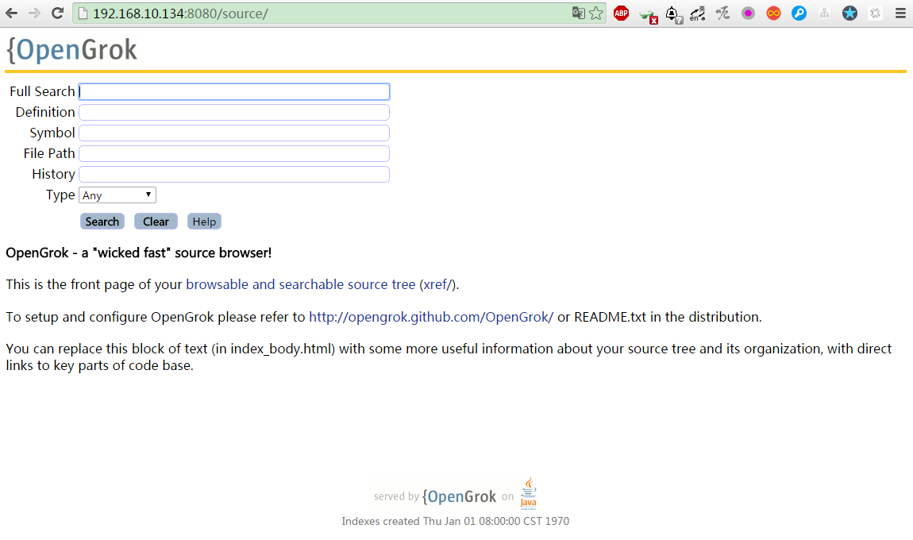
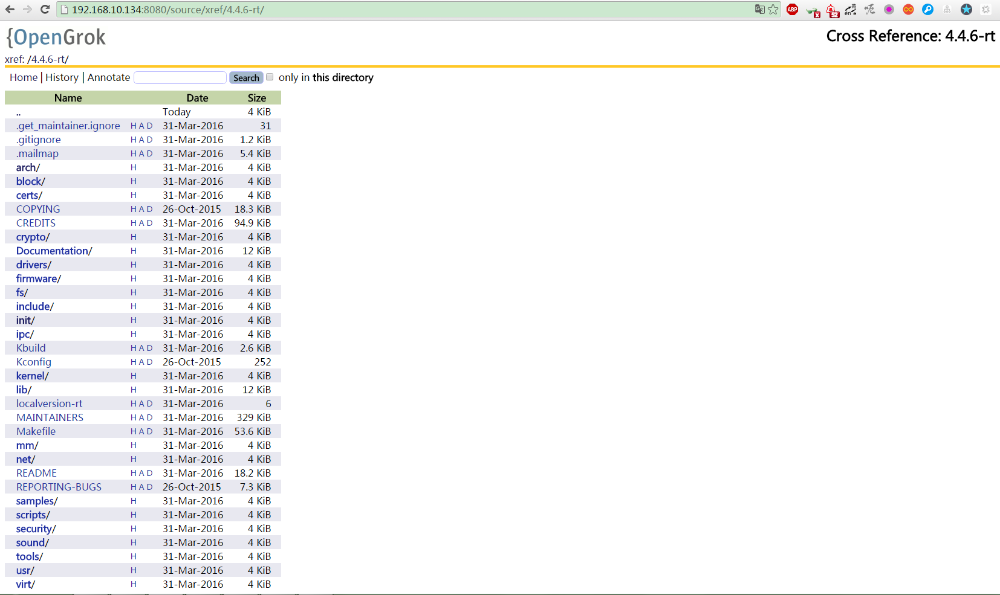

Ubuntu环境下OpenGrok的安装及使用
=======

http://tangzm.com/blog/?p=277

http://blog.csdn.net/gaolegao3/article/details/51674224

| CSDN | GitHub |
|:----:|:------:|
| [Aderstep--紫夜阑珊-青伶巷草](http://blog.csdn.net/gatieme) | [`AderXCoding/system/tools`](https://github.com/gatieme/AderXCoding/tree/master/system/tools) |


<br>
<a rel="license" href="http://creativecommons.org/licenses/by-nc-sa/4.0/"></a>
本作品采用<a rel="license" href="http://creativecommons.org/licenses/by-nc-sa/4.0/">知识共享署名-非商业性使用-相同方式共享 4.0 国际许可协议</a>进行许可, 转载请注明出处
<br>


#1	OpenGrok介绍
-------


`OpenGrok`是一个快速, 便于使用的源码搜索引擎与对照引擎, 它能够帮助我们快速的搜索、定位、对照代码树. 接下来就具体讲解一下OpenGrok的安装及使用.


#2	安装OpenGrok
-------


##2.1	安装JAVA运行环境
-------

`OpenGrok` 是基于 `JAVA`  的, 因此我们首先需要 `JDK` 和 `JRE` 来支持其运行

```cpp
sudo add-apt-repository ppa:webupd8team/java
sudo apt-get update
sudo apt-get install oracle-java8-installer
sudo apt-get install oracle-java8-set-default
```

具体安装请参照 [Ubuntu安装JDK详解](http://blog.csdn.net/gatieme/article/details/52723931)


##2.2	安装Web服务器-Tomcat
-------

首先大家应该明白 `OpenGrok` 是一个 `Web` 系统, 因此要共享 `OpenGrok` 搜索引擎, 需要安装 `Web` 服务器.

在 `Ubuntu` 环境下, 推荐使用 `Tomcat`.

`Ubuntu14.04` 的源中已经提供了`Tomcat 7` 的包, 参见

http://packages.ubuntu.com/trusty/tomcat7

*	安装 `Tomcat7`, 直接从源中安装 `Tomcat7`.


```cpp
sudo apt-get install tomcat7
```

*	启动 `Tomcat7`

```cpp
sudo service tomcat7 start
```

或者

```cpp
sudo /etc/init.d/tomcat7 start
```


启动 `Tomcat` 服务后, 在浏览器中输入网址

http://localhost:8080

能够进入以下页面证明Tomcat运行成功.

更加详细的安装, 请参照[Ubunt安装和配置tomcat8服务](http://blog.csdn.net/gatieme/article/details/53073548)

##2.3	安装OopenGrok
-------


安装好 `Tomcat`  后, 接下来就是配置 `OpenGrok`  了.

`OpenGrok` 下载地址 :


http://opengrok.github.io/OpenGrok

在该网址中可以下载 `OpenGrok` 的编译文件, 也可以下载源文件. 在此我们直接下载编译文件(对OpenGrok感兴趣的同学可以下载源码查看究竟）, 下载后通过以下命令进行解压：

```cpp
tar xvzf opengrok-0.11.1.tar.gz -C /opt
```


##2.4	配置OpenGrok
-------


如果希望 `OpenGrok`  能够正常运行, 则需要很多环境变量, 如果我们按照 `OpenGrok`的要求安装 `jdk` , `Tomcat`  和 `OpenGrok` , 并建立好目录结构的话, 这些环境变量在运行 [`OpenGrok`](https://github.com/OpenGrok/OpenGrok/blob/master/OpenGrok) 脚本的时候会被正确设置, 但是如果我们希望配置更加灵活的话, 还是自定义目录结构, 然后手动的配置这些环境变量吧, 


环境变量的配置如下

```cpp
#cat mysetenv.sh

#-------------------------------------------------------------------------------
#   - JAVA_HOME                   Full Path to Java Installation Root
#   - JAVA                        Full Path to java binary (to enable 64bit JDK)
#   - JAVA_OPTS                   Java options (e.g. for JVM memory increase
#-------------------------------------------------------------------------------
JAVA_HOME=/usr/lib/jvm/java-8-oracle
JRE_HOME=$JAVA_HOME/jre
JAVA_BIN=$JAVA_HOME/bin
CLASSPATH=$JAVA_HOME/lib/dt.jar:$JAVA_HOME/lib/tools.jar:$JRE_HOME/lib
PATH=$PATH:$JAVA_HOME/bin:$JRE_HOME/bin
export JAVA_HOME JRE_HOME PATH CLASSPATH


#-------------------------------------------------------------------------------
#   - OPENGROK_DISTRIBUTION_BASE  Base Directory of the OpenGrok Distribution
#   - OPENGROK_INSTANCE_BASE      Base Directory of the OpenGrok User Data Area
#   - EXUBERANT_CTAGS             Full Path to Exuberant CTags
#   - OPENGROK_CTAGS_OPTIONS_FILE Full path to file with extra command line
#                                 options for CTags program (for its --options
#-------------------------------------------------------------------------------
#  opengrok home directory
export OPENGROK_INSTANCE_BASE=/opt/opengrok
export SCRIPT_DIRECTORY=$OPENGROK_INSTANCE_BASE/bin
export OPENGROK_DISTRIBUTION_BASE=$OPENGROK_INSTANCE_BASE/lib


#  source code root
export SRC_ROOT=$OPENGROK_INSTANCE_BASE/database/src
#  generated data root
export DATA_ROOT=$OPENGROK_INSTANCE_BASE/database/data
#
EXUB_CTAGS=/usr/bin/ctags


#-------------------------------------------------------------------------------
#   - OPENGROK_APP_SERVER         Application Server ("Tomcat" or "Glassfish")
#   - OPENGROK_WAR_TARGET_TOMCAT  Tomcat Specific WAR Target Directory
#   - OPENGROK_WAR_TARGET_GLASSFISH Glassfish Specific WAR Target Directory
#   - OPENGROK_WAR_TARGET         Fallback WAR Target Directory
#   - OPENGROK_TOMCAT_BASE        Base Directory for Tomcat (contains webapps)
#   - OPENGROK_GLASSFISH_BASE     Base Directory for Glassfish
#                                 (contains domains)
#-------------------------------------------------------------------------------
export OPENGROK_APP_SERVER=Tomcat
export OPENGROK_TOMCAT_BASE=/opt/apache-tomcat
export OPENGROK_WAR_TARGET_TOMCAT=$OPENGROK_TOMCAT_BASE/webapps
export OPENGROK_WAR_TARGET=$OPENGROK_TOMCAT_BASE/webapps
export CATALINA_HOME=$OPENGROK_TOMCAT_BASE
```

完成后, 每次在运行 `OpenGrok` 之前就可以使用`mysetenv.sh` 脚本来设置环境变量了

```cpp
source mysetenv.sh
```

我们可以直接将这条命令加载 `OpenGrok` 脚本的开头

OpenGrok脚本的信息请参见https://github.com/OpenGrok/OpenGrok/blob/master/OpenGrok

如果运行出错请查看源代码自行设置环境变量的信息


解压完成后进入到解压目录, 将 `/opt/opengrok/lib`  目录下的 `source.war`  包拷贝到`apache-tomcat/webapps`  目录下

或者执行

```cpp
sudo ./OpenGrok deplay
```

系统会自动将 `$OPENGROK_DISTRIBUTION_BASE/source.war`  拷贝到 `OPENGROK_WAR_TARGET_TOMCAT` 下


在浏览器中输入

http://localhost:8080/source/

看到以下界面证明OpenGrok运行成功.




接下需要更改 `apache-tomcat/webapps/source/WEB-INF` 目录下的web.xml配置文件

```html
<context-param>
   <param-name>CONFIGURATION</param-name>
   <param-value>/opt/opengrok/etc/configuration.xml</param-value>
   <description>Full path to the configuration file where OpenGrok can read it's configuration</description>  
 </context-param>
```

配置 `configuration.xml` 的路径

> **提示**
>
> 实验发现这个xml不配置也是可以正常使用的


##2.5	建立源码索引
-------


下面我们就需要为我们的源码配置索引了, `OpenGrok`  生成源代码的索引信息

设置的话需要如下环境变量

| 环境变量 | 描述 | 默认值 |
|:----------:|:-----:|:-------:|
| SRC_ROOT | 待生成索引的源代码路径 | ${OPENGROK_INSTANCE_BASE}/src |
| DATA_ROOT | 存放生成的索引的路径 | ${OPENGROK_INSTANCE_BASE}/data |

那么我们直接在 `opengrok` 的安装目录 `/opt/opengrok` 下创建 `src` 和 `data`目录即可


但是我为了方便管理, 建立了一个 `database` 二级目录, 将 `src` 和 `data` 放在这个二级目录里面.


为了使得环境变量能够正确识别, 我们可以修改 `OpenGrok` 脚本的源代码, 重置 `SRC_ROOT` 和 `DATA_ROOT` 的值.

```cpp
# 修改/opt/opengrok/bin/OpenGrok

SRC_ROOT="${OPENGROK_INSTANCE_BASE}/src"
改为
SRC_ROOT="${OPENGROK_INSTANCE_BASE}/database/src"

DATA_ROOT="${OPENGROK_INSTANCE_BASE}/data"
改为
DATA_ROOT="${OPENGROK_INSTANCE_BASE}/database/data"
```

但是由于我已经在 `mysetenv.sh` 中设置了 `SRC_ROOT` 和 `DATA_ROOT` 的值, 因此我是这么修改的

```cpp
if [ ! -n "${SRC_ROOT}" ]; then
	# REQUIRED: Source Code/Repository Root
 	#           (your source code or the root of all repositories)
  	SRC_ROOT="${OPENGROK_INSTANCE_BASE}/src"
fi

if [ ! -n "${DATA_ROOT}" ]; then
   	# REQUIRED: OpenGrok Generate Data Root
   	#           (for Lucene index and hypertext cross-references)
   	#           This area is rebuilt by "update" / "updateQuietly"
   	DATA_ROOT="${OPENGROK_INSTANCE_BASE}/data"
fi
```

接着我们将需要索引的源码放在 `src` 目录下即可, 当然我们其实没必要把源码真的放到这里, 只需要为其创建一个链接即可

```cpp
cd /opt/opengrok/database/src
ln -s /usr/src/linux-4.4.6  4.4.6
```


生成索引


```cpp
#./OpenGrok index
```

指定SRC_ROOT

```cpp
./OpenGrok index <absolute_path_to_your_SRC_ROOT>
```


接着我们打开

http://localhost:8080/source

就可以看到我们的源代码了


